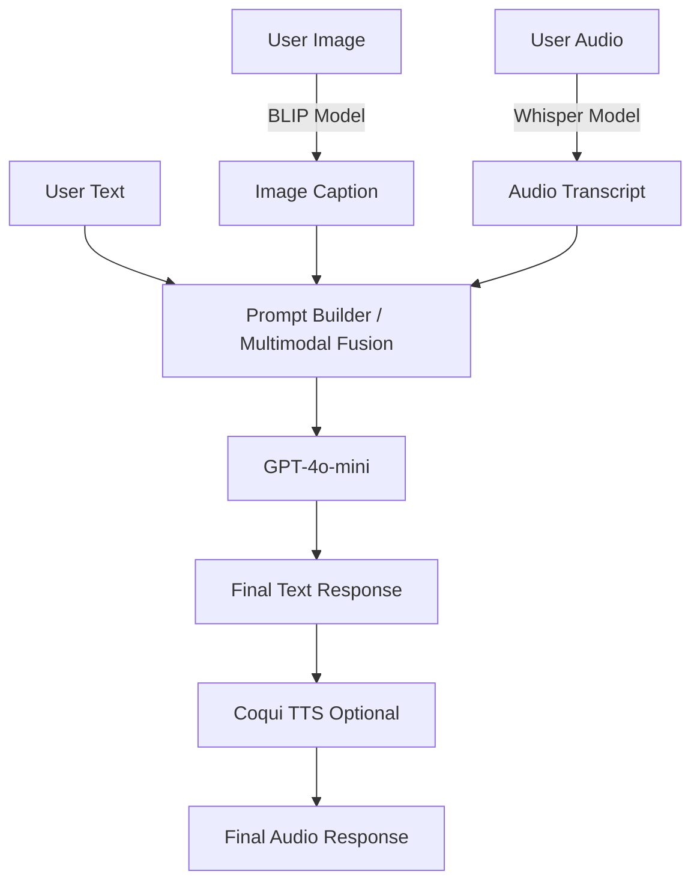

# Multimodal AI Assistant

## Project Overview
The Multimodal AI Assistant is a Python-based application that processes Text, Image, and Audio inputs to generate a unified, context-aware response. It uses state-of-the-art machine learning models to synthesize multiple modalities into a single coherent answer.

## Features
- **Accepts Multiple Modalities**: Text, Image (JPG/PNG), Audio (WAV/MP3).
- **Supports Combinations**: Text+Image, Text+Audio, Image+Audio, Text+Image+Audio.
- **Image Processing**: Uses Salesforce BLIP Base to generate image captions.
- **Audio Processing**: Uses OpenAI Whisper Base to transcribe audio into text.
- **Unified Reasoning**: Fuses inputs and queries OpenAI GPT-4o-mini to generate an answer.
- **Optional Text-to-Speech**: Synthesizes the generated text response back into spoken audio using Coqui TTS.

## Architecture



## Installation Instructions

1. **Clone the repository** (if applicable) and navigate to the project directory:
```bash
cd multimodal-ai-assistant
```

2. **Create a virtual environment (Recommended)**:
```bash
python -m venv venv
# Windows
venv\Scripts\activate
# macOS/Linux
source venv/bin/activate
```

3. **Install dependencies**:
```bash
pip install -r requirements.txt
```

4. **Environment Variables Setup**:
Copy the example environment file and set your OpenAI API key:
```bash
cp .env.example .env
```
Edit the `.env` file and replace `your_openai_api_key_here` with your actual OpenAI API key.

## How to Run
Execute the following command from the root directory:
```bash
python app.py
```
Open the provided local URL (e.g., `http://127.0.0.1:7860/`) in your browser to interact with the Gradio interface.

## Examples of Input Combinations

### 1. Text + Image
- **Text**: "What is unusual about this image?"
- **Image**: An image of a cat riding a skateboard.
- **Output**: The system captions the image ("A cat on a skateboard") and the LLM responds addressing the text question using the caption.

### 2. Text + Audio
- **Text**: "Translate what is said to French."
- **Audio**: Spoken English ("Hello, how are you today?").
- **Output**: The system transcribes the audio and the LLM translates the transcribed text into French.

### 3. Image + Audio
- **Image**: An image of the Eiffel Tower.
- **Audio**: Spoken ("What city is this monument located in?").
- **Output**: The system captions the image, transcribes the audio query, and the LLM answers "Paris".

### 4. Text + Image + Audio
- **Text**: "Explain the historical significance of the object in the image."
- **Image**: An image of the Rosetta Stone.
- **Audio**: Spoken ("Also, where is it currently housed?").
- **Output**: The system combines the text prompt, image caption, and audio transcript to provide a comprehensive answer covering both its historical significance and its current location (the British Museum).
